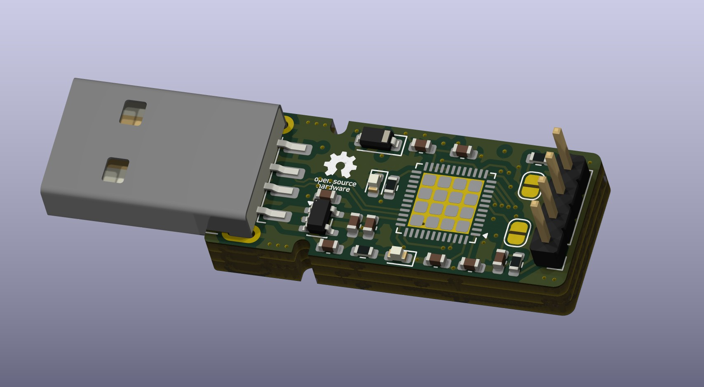

# FeRamDisk: 基于 STM32G431 的铁电存储 U 盘

 
 
 


## 项目概述
FeRamDisk 是一款基于 **STM32G431** 主控与 **MB85RS256** 存储介质的专用闪存盘。

不同于传统的 NAND Flash 存储方案，本项目利用铁电随机存取存储器（FeRAM）的物理特性，实现了极高的读写耐久性与近乎瞬时的随机访问能力。

硬件设计中使用了四片并列的 **MB85RS256** ，单片容量为 32 kB（即 256 Kbit），总计达到的存储空间为 128 kB。



## 功能介绍

1. **硬件设计开源**：提供完整的 Kicad 工程、原理图及制造文件，可直接打板生产。
2. **USB 大容量存储设备固件设计**：基于 Rust embassy 异步框架，从零实现 SCSI 指令集与 BOT 协议，支持全平台免驱识别。
3. **影子存储区防止文件系统崩溃**：利用日志机制抽象存储操作，保障意外断电及插拔时的数据一致性。

## 快速上手

项目固件采用 Rust 编写。构建前请确保已安装 Rust 工具链。

```bash
cd firmware

# 编译固件（默认已启用 hardware feature）
cargo build --release

# 在主机上运行脱离硬件的单元测试（需关闭默认的硬件功能并指定主机平台）
# 另外需要根据自己的开发环境选择正确的目标平台
cargo test --no-default-features --target x86_64-pc-windows-msvc

# 如果已配置 probe-rs 等烧录工具，可直接一键编译并烧录
cargo run --release
```

## 项目构成

- `hardware/`: 硬件设计目录（包含 Kicad 源工程、BOM 表及 Gerber 生产文件）。
- `firmware/`: 核心固件目录（Rust 编写）。
  - `src/usb/`: USB 核心协议栈（MSC / BOT / SCSI）的具体实现。
  - `src/storage/`: 存储后端适配与事务日志系统（Journaling），确保块设备的高可靠读写。
  - `src/drivers/`: SPI 通信底漆及 MB85RS256 铁电存储芯片的驱动层。
  - `tests/`: 包含脱离硬件直接在 PC 端运行的协议栈软仿真测试环境。
- `docs/`: 相关的项目说明与文档资源。

## 贡献要点

欢迎任何形式的讨论与代码贡献（Pull Request / Issue）：
1. **固件开发**：PR 提交前，请确保能够通过 `tests/` 目录下的所有软仿真单元测试 (`cargo test`)。
2. **硬件优化**：如有 PCB 布局或元器件替代方案，请提供原因及 Kicad 源文件的修改。
3. **想法拓展**：欢迎探讨铁电特性（极快且无磨损限制）在微型数据记录器（Data Logger）等前沿领域的新用法。
